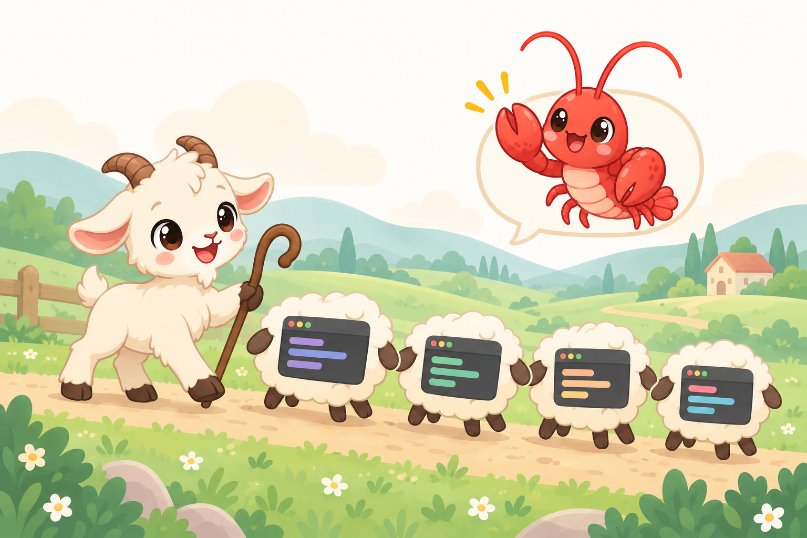

<div align="center">
  

  # openclaw-herdr
  *Drive the coding agents in your Herdr panes from OpenClaw chat*

  [](https://github.com/dobbygl/openclaw-herdr/actions)
  [](https://nodejs.org)
  [](https://docs.openclaw.ai/cli/plugins)
  [](LICENSE)

  [Features](#features) • [Installation](#installation) • [Usage](#usage) • [Remote machines](#remote-machines) • [How it works](#how-it-works) • [Configuration](#configuration)
</div>

<p align="center"></p>

`openclaw-herdr` is an [OpenClaw](https://openclaw.ai) plugin that lets you talk to Claude Code, Codex, or any other coding agent already running inside [Herdr](https://herdr.dev) panes. Send a prompt from Telegram or the OpenClaw web chat, keep the terminal visible for yourself, and get pinged when the agent finishes or stops to ask a question.

It replaces screen scraping with Herdr's own agent lifecycle API, so it does not care which version of Herdr, Claude Code or Codex you run today.

> [!NOTE]
> Status: prototype under live testing. `/herdr list`, `/herdr status`, `/herdr read` and `/herdr <pane>: <prompt>` are verified from Telegram against a real Gateway (milestone M1.5); two delivery mechanisms were disproved live (a bare heartbeat wake, then `chat.send`, which the Gateway reserves for official plugins), so notifications now run a heartbeat turn in the originating session, verified live. Remote machines (milestone M2.5 — discovery, the `selector@server` grammar, the SSH stdio transport, `remote.allowSend`) are implemented but not yet exercised live against a saved machine. See [docs/PLAN.md](docs/PLAN.md).

## Features

- **Send from chat** — `/herdr w6:p1: run the tests` submits a prompt to one pane, respecting bracketed paste.
- **Get woken up** — one event subscription per watched pane; you receive a message when the agent goes idle, finishes, blocks on a question, or exits. No polling.
- **Never guess** — targets must resolve to exactly one live agent. Ambiguity and Herdr's `unknown` state are reported, not papered over.
- **Blocked-aware** — if the agent is waiting at an approval or question, the plugin shows you the prompt instead of typing over it.
- **Agent tools too** — `herdr_list`, `herdr_send`, `herdr_read`, `herdr_watch` and `herdr_status` let the OpenClaw agent orchestrate panes on its own.
- **Survives restarts** — watches live in a small JSON file and are re-subscribed when the Gateway comes back.
- **Zero runtime dependencies** beyond `typebox`; talks to the local Herdr over its Unix socket, and to remote Herdr machines over SSH stdio (see [Remote machines](#remote-machines)).

## Installation

Requirements: OpenClaw `2026.9.2+`, Herdr `0.9.x` running locally (`herdr status server`), Node.js `24.16+` (required by OpenClaw itself), and a coding agent started inside a Herdr pane.

```bash
git clone https://github.com/dobbygl/openclaw-herdr.git
cd openclaw-herdr
npm install
npm run build
openclaw plugins install --link --accept-capabilities "$PWD"
openclaw gateway restart
```

`--link` keeps OpenClaw pointed at your checkout, so `npm run build` followed by a Gateway restart is enough to pick up changes. Drop it to copy the plugin into OpenClaw instead. The plugin registers under the id `herdr`, so it appears as `plugins.entries.herdr` in `openclaw.json`.

Check that the plugin can see Herdr before using it from chat:

```bash
npm run smoke
```

> [!IMPORTANT]
> OpenClaw warns that a local path is outside ClawHub review. That is expected until the plugin is published; review the source before accepting.

## Usage

From any OpenClaw chat surface:

```text
/herdr list                      agents Herdr currently sees
/herdr w6:p1: fix the failing test and explain the cause
/herdr fix the failing test      same, when exactly one agent is running
/herdr status w6:p1              state plus the last lines of output
/herdr read w6:p1 60             more output (1–400 lines)
/herdr watch w6:p1               wake me when the current task settles
/herdr unwatch w6:p1
/herdr start cuento codex ~/app  open a new pane, start Codex there as "cuento"
```

`start` reuses an empty pane already labelled with that name, otherwise it opens a new tab in the focused workspace. From then on the name is the target: `/herdr cuento: write the tests`. On a remote machine it needs `remote.allowSend`, like any other input.

A target is resolved in strict order: Herdr pane id (`w6:p1`), terminal id, Herdr agent name (`reviewer`), then agent kind (`claude`, `codex`). More than one match at a level is refused with the candidates listed; the plugin never guesses.

When a watched agent settles, the originating chat gets a short message like:

```text
Herdr: w6:p1 (claude) finished.
> fix the failing test and explain the cause
```
followed by the tail of the pane. A `needs your input` variant appears when Herdr detects an approval or question UI.

Pane output is compacted for phones before it reaches the chat: trailing whitespace, 120-column divider rules, the empty composer and the agent's footer hints are stripped; blocks are capped at 3000 characters and 400 characters per line, and triple backticks in agent output are neutralized so they cannot close the code block. This is presentation only; agent state always comes from Herdr.

> [!TIP]
> Agents started with `claude` or `codex --yolo` in bypass mode will run whatever you send. Keep the `/herdr` command restricted to authorized senders (the default) and prefer normal permission modes for anything that touches production.

## Remote machines

Herdr itself can reach agents on a machine other than the one running
OpenClaw. This plugin does not configure those machines — it discovers
whatever Herdr already knows about and speaks to them directly.

**Link a machine, once, in Herdr:**

```bash
herdr machine add <user>@<host> --label buildbox
```

That first run is interactive. After that the plugin picks the machine up
automatically from `herdr machine list` — nothing is duplicated in
`openclaw.json`.

Two things must hold for the plugin to reach it without a prompt:

- The SSH user (`<user>` above) must own the remote Herdr socket, or at least
  be able to read it — it is mode `0600`. `herdr machine add` requires the
  same user, so if that worked, this will too.
- An SSH key for that user must already be loaded (`ssh-add`) before the
  Gateway starts. The plugin's SSH options are fixed and non-negotiable:
  `BatchMode=yes` means it can never wait on a password prompt, and
  `StrictHostKeyChecking=yes` means the host key must already be trusted
  (which the interactive `herdr machine add` above takes care of). The
  remote host also needs `socat` installed, which is what carries the Herdr
  socket protocol over the SSH session.

**Targeting a machine** — add `@<label>` (or the machine's id) to any
selector:

```text
/herdr list                            local agents, then one group per machine
/herdr status w1:p1@buildbox           state of a pane on "buildbox"
/herdr w1:p1@buildbox: run the tests   send a prompt to that pane
```

No suffix means the local host. `@buildbox` must match a machine label
(case-sensitive) or id exactly; an unknown one is refused with the list of
machines the plugin actually knows about.

Remote machines are **read-only by default**: `list`, `status`, `read` and
`watch` all work, but a prompt to a remote pane is refused —
`I did not send anything to **w1:p1@buildbox**: buildbox is read-only.` —
until its label or id is added to `remote.allowSend` in the plugin config.

A machine that cannot be reached (asleep, SSH down, key not loaded) shows as
`down` in `/herdr list` with a short reason instead of stalling the whole
list:

```text
Machine lab: down — ssh authentication failed
```

Remote watches behave exactly like local ones: one event subscription per
watched pane, reconciled through `agent.get`. An SSH drop is just a closed
subscription — the plugin reconnects with backoff and reconciles rather than
guessing what happened while it was gone.

## How it works

```text
Telegram / WebChat ──► OpenClaw Gateway ──(in-process)──► openclaw-herdr ──JSON lines──► herdr.sock ──► Herdr ──► Claude Code / Codex pane
```

1. `/herdr …` is parsed into a small command; the target is resolved against a fresh `agent.list`.
2. Prompts go through `agent.prompt`. Herdr refuses with `agent_blocked` if the agent is at a prompt, before any input is sent.
3. A watch record is stored and a `pane.agent_status_changed` subscription is opened for that pane.
4. On `idle | done | blocked` the plugin confirms with `agent.get` (same occupant, `state_change_seq` advanced), reads the last lines, stores a pending delivery, queues the event as durable context in the originating session and runs one heartbeat turn there right away (`runHeartbeatOnce`), which relays the message to the session's channel. A skipped or failed turn is retried until the watch deadline.
5. Several chats may watch the same pane; each gets its own notification and `unwatch` only removes the caller's watch.
6. A `@server` target talks to that machine's socket the same way, except the JSON lines travel over `ssh <target> socat - UNIX-CONNECT:<sock>` instead of the local socket. SSH's own `ControlMaster` multiplexing keeps one authenticated session per machine warm, so only the first call pays for a fresh handshake — measured ≈0.6 s per request there afterwards, against 6–12 s through Herdr's own `herdr --machine`.

Herdr classifies agents with detection rules it updates by itself; this plugin never parses terminal text to decide anything. Details in [docs/ARCHITECTURE.md](docs/ARCHITECTURE.md) and [docs/HERDR_API.md](docs/HERDR_API.md).

## Configuration

Optional keys under `plugins.entries.herdr.config` in `openclaw.json`:

| Key | Default | Purpose |
| --- | --- | --- |
| `socketPath` | `$HERDR_SOCKET_PATH` or `~/.config/herdr/herdr.sock` | Local Herdr server socket |
| `requestTimeoutMs` | `5000` | Timeout per **local** Herdr request; remote requests use their own, larger fixed budget |
| `watchTimeoutMinutes` | `720` | Ceiling for a watch that never settles; undelivered notifications are retried until then |
| `readLines` | `40` | Lines of pane output included in notifications and `/herdr read` |
| `herdrBin` | `herdr` on `PATH` | `herdr` executable used to list saved machines (`herdr machine list --json`) and resolve their sockets |
| `sshBin` | `ssh` on `PATH` | `ssh` executable used to reach remote machines |
| `remote.enabled` | `true` | Whether remote machines are discovered at all; `false` leaves only the local host |
| `remote.allowSend` | `[]` | Machine labels or ids allowed to receive prompts and key presses; every other machine stays read-only |

## Development

```bash
npm install
npm run typecheck
npm test
npm run smoke      # read-only check against your local Herdr
npm run check      # typecheck + tests + build
```

Design decisions are recorded in [docs/adr](docs/adr). The roadmap and the incident that motivated this project are in [docs/PLAN.md](docs/PLAN.md).
